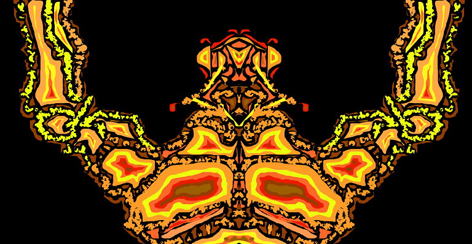

# <ins>Portefolio d'art de Kadyrov</ins>

> Voici une œuvre crée sur Alchemy en 4 étapes :
 
- Premièrement j'ai réalisé un cyborg détaillé avec un certain panel de couleurs : 
 

- Ensuite j'ai ajouté une armure à la silhouette :
 

- Encore un peu de détail...

- Pour finir j'ai travaillé un fond plutôt abstrait pour combler le vide ambiant

 

  

    

      

          

            <svg>
              <ellipse class="blob blob--top" cx="35" cy="0" rx="35" ry="10"></ellipse>
              <ellipse class="blob blob--bottom" cx="75" cy="270" rx="75" ry="10"></ellipse>
              <circle class="blob" r="15" cx="0" cy="400" style="--skewX: -1; --skewY: 0; --height: 30; --speed: 41; --delay: -8; --direction: alternate;"></circle>
              <circle class="blob" r="36" cx="107" cy="400" style="--skewX: -4; --skewY: -2; --height: 72; --speed: 19; --delay: -7; --direction: alternate-reverse;"></circle>
              <circle class="blob" r="37.5" cx="96" cy="400" style="--skewX: 2; --skewY: 4; --height: 75; --speed: 34; --delay: -7; --direction: alternate;"></circle>
            </svg>
          

          

            <svg>
              <ellipse class="blob blob--top" cx="35" cy="0" rx="35" ry="10"></ellipse>
              <ellipse class="blob blob--bottom" cx="75" cy="270" rx="75" ry="10"></ellipse>
              <circle class="blob" r="27.5" cx="33" cy="400" style="--skewX: 0; --skewY: -2; --height: 55; --speed: 22; --delay: -4; --direction: alternate-reverse;"></circle>
              <circle class="blob" r="34" cx="97" cy="400" style="--skewX: 5; --skewY: 0; --height: 68; --speed: 46; --delay: 0; --direction: alternate-reverse;"></circle>
              <circle class="blob" r="42.5" cx="93" cy="400" style="--skewX: -3; --skewY: -2; --height: 85; --speed: 21; --delay: 0; --direction: alternate;"></circle>
              <circle class="blob" r="25.5" cx="19" cy="400" style="--skewX: -3; --skewY: -4; --height: 51; --speed: 45; --delay: -8; --direction: alternate;"></circle>
            </svg>
          

          

            <svg>
              <ellipse class="blob blob--top" cx="35" cy="0" rx="35" ry="10"></ellipse>
              <ellipse class="blob blob--bottom" cx="75" cy="270" rx="75" ry="10"></ellipse>
              <circle class="blob" r="32" cx="10" cy="400" style="--skewX: 1; --skewY: -2; --height: 64; --speed: 37; --delay: -7; --direction: alternate;"></circle>
              <circle class="blob" r="25" cx="88" cy="400" style="--skewX: 2; --skewY: 2; --height: 50; --speed: 30; --delay: -10; --direction: alternate;"></circle>
            </svg>
          

          

            <svg>
              <ellipse class="blob blob--top" cx="35" cy="0" rx="35" ry="10"></ellipse>
              <ellipse class="blob blob--bottom" cx="75" cy="270" rx="75" ry="10"></ellipse>
              <circle class="blob" r="33" cx="138" cy="400" style="--skewX: -1; --skewY: 0; --height: 66; --speed: 48; --delay: -5; --direction: alternate-reverse;"></circle>
            </svg>
          

      

    

    

  

  <svg style="position: absolute; left: 100%">
    <defs>
      <filter id="goo">
        <feGaussianBlur in="SourceGraphic" stdDeviation="10" result="BLUR"></feGaussianBlur>
        <feColorMatrix in="BLUR" mode="matrix" values="1 0 0 0 0  0 1 0 0 0  0 0 1 0 0  0 0 0 18 -7" result="GOO"></feColorMatrix>
        <feBlend in="SourceGraphic" in2="goo"></feBlend>
      </filter>
    </defs>
  </svg>

 

<html>
    <head>
        <title>Custom Slider</title>
    </head>
    <body>
        

            

                <label for="slide-dot-1"></label>
                <label for="slide-dot-2"></label>
                <label for="slide-dot-3"></label>
            

            <input class="slide-input" id="slide-dot-1" type="radio" name="slides" checked>
            

            <input class="slide-input" id="slide-dot-2" type="radio" name="slides">
            

            <input class="slide-input" id="slide-dot-3" type="radio" name="slides">
            

        

    </body>
</html> 